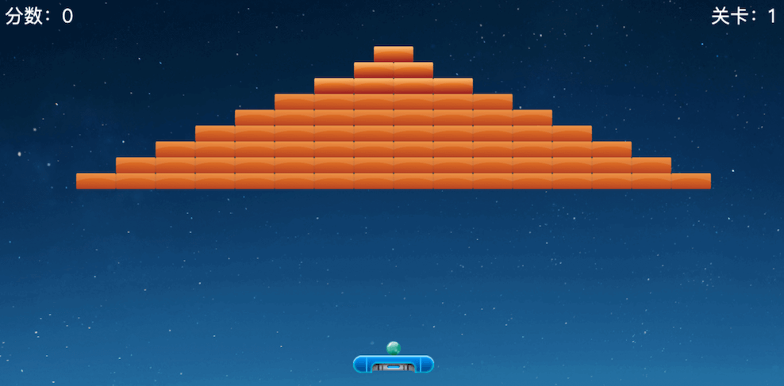

<!-- TOC -->
* [浅谈前端 CPU 性能](#浅谈前端-cpu-性能)
  * [序](#序)
  * [从计算总资产的 case 开始看](#从计算总资产的-case-开始看)
    * [代码](#代码)
    * [问题](#问题)
    * [解决方案1 - 重构代码](#解决方案1---重构代码)
    * [解决方法2 - 局部 hack](#解决方法2---局部-hack)
    * [解决方法3 - 思路转换，从推改拉的模式](#解决方法3---思路转换从推改拉的模式)
  * [后](#后)
<!-- TOC -->

# 浅谈前端 CPU 性能

## 序

这篇文章住要想要讨论，交易所这种实时性强的系统，前端在 cpu 性能上可能遇到的问题

为了具体问题具体分析，我们假定使用的是 rxjs 来实现的实时计算

## 从计算总资产的 case 开始看

### 代码

假定我们有一个总资产的计算，我们需要实时的计算不同交易模式的总资产，我们写出了如下的代码

```typescript
const totalAsset$ = combineLatest(
    spotAsset$,
    marginAsset$,
    contractAsset$,
    // ...
).pipe(
    map(([spotAsset, marginAsset, contractAsset]) => mergeAsset(spotAsset, marginAsset, contractAsset))
)
```

### 问题

每次 mergeAsset 这个函数都会被计算 n（交易模式种类数） 次，这是因为每一个 assets 都融入了 price$ 流，每次 price$ 一有变化，每个
asset$ 都会变化

这也是 rxjs 非常常见的一个问题，一旦依赖的逻辑是有耦合的，就会导致重复计算

### 解决方案1 - 重构代码

最佳的办法，当然是将严格梳理逻辑，将依赖的逻辑最小化，代码改成如下

```typescript
const totalAsset$ = combineLatest(
    price$,
    spotBaseAsset$,
    marginBaseAsset$,
    contractBaseAsset$,
    // ...
).pipe(
    map(([prices, spotBaseAsset, marginBaseAsset, contractBaseAsset]) => {
        const spotAsset = calcRealTimeAsset(prices, spotBaseAsset)
        const marginAsset = calcRealTimeAsset(prices, marginBaseAsset)
        const contractAsset = calcRealTimeAsset(prices, contractBaseAsset)
        return mergeAsset(spotAsset, marginAsset, contractAsset)
    })
)
```

优点：

这是在要求 **必须严格实时更新数据** 的要求下，最合理的结构

缺点：

使用了 rxjs 的代码，往往及其复杂，想要梳理出一个时序更是难上加难，对每一个地方的改动都会牵一发而动全身，同时回归测试也很困难

总结：

这种方案只适合于高水平的开发团队，要求这三者缺一不可

1. 开发者水平够
2. 对系统有全貌的了解
3. 每次需求变更都能适当重构代码，求出当前最优解

### 解决方法2 - 局部 hack

既然明确了是 combineLatest 导致的问题，那就用仅解决这一个问题，可以使用 debounce 或者 throttle 来处理

```typescript
const totalAsset$ = combineLatest(
    spotAsset$,
    marginAsset$,
    contractAsset$,
    // ...
).pipe(
    /**
     * 如果没有能力来具体分析问题，可以用 debounce + 50ms 的通用的配置来解决
     */
    debounceTime(100),
    // throttleTime(100),
    map(([spotAsset, marginAsset, contractAsset]) => mergeAsset(spotAsset, marginAsset, contractAsset))
)
```

优点：

1. 尽管实际 n 个流都发生了变化，但是规避了重复计算
2. 影响面小，可以逐步迭代处理问题（这是真正的优势）

缺点：

1. 窗口时间 100ms 过于 magic，纯粹依靠经验
2. 使用 debounce 还是 throttle 需要依靠具体的业务逻辑，不是一个通用的解决方案
3. 稍不注意就会出 bug（例如 debounce 之后，事件变更频率小于窗口时间，迟迟不进行计算）

总结
比较适合梳理不动代码，解决局部问题的时候采用的方案。还是要求开发者本身合格，针对这个具体场景有足够的分析，选择合适的方法和时长

### 解决方法3 - 思路转换，从推改拉的模式

其实前端并不需要严格进行实时计算，或者说前端系统本身的“实时”需要从更大面的考量来实现（engine侧的推送服务，推送机制：推送内容、数据结构，频率）

> TODO:
>
> 我很想在这拓展讲一讲 Engine 的内容
>
> 任何一个系统的最优解一定不可能是基于某一部份内容孤立分析得出
>
> 这里最需要讨论、优化的是 api 的设计问题，更直白地说就是前端应当参与到 api 的设计中来，从而设计出最贴合使用场景的 api

我在这里参考之前游戏引擎的设计，引入类似帧率的概念

拿一个简单的打砖块游戏举例



分析一下游戏的运行过程，假设帧率是 60fps，那么每间隔 1000 / 60 = 16.67ms，就会调用一次渲染函数

渲染时根据小球的当前坐标&速度&时间差，计算出下一帧的坐标，然后进行碰撞检测，最后渲染出来

帧率越高，计算越频繁，cpu 占用越高，用户看到的图像变化越小，体感越流畅

```typescript
// 全局流
const globalFrame$ = interval(1000)
// 业务代码
const totalAsset$ = frame$.pipe(
    withLatestFrom(
        spotAsset$,
        marginAsset$,
        contractAsset$,
        // ...
    ),
).pipe(
    map(([_, spotAsset, marginAsset, contractAsset]) => mergeAsset(spotAsset, marginAsset, contractAsset))
)
```

优点：

1. 代码简单，逻辑清晰
2. 适用于绝大部分场景
3. 对开发者的水平要求略低
4. 拓展性强，你可以动态改变帧率，甚至可以直接将选项暴露给用户去选择合适他的档位

缺点：

1. 还是需要重构大量代码
2. 实时性略有下降
3. 容易出现 cpu usage 的波峰波谷 (这个才是真正的问题，因为计算都集中在某一个点上了)

如何避免波峰波谷? 我提供一个思路

可以将 globalFrame$ 改成一个池子，这个池子可以均匀派多个时间流，订阅的时候均匀订阅到不同的流里去

甚至可以更进一步，将池子的大小和设备的 cpu 性能关联起来，越好的 cpu ，池子里的流越少

如何估算 cpu 性能？navigator.hardwareConcurrency，这个可以拿到 cpu 逻辑核数，可以作为参考依据
（当然我们知道核心数量和 cpu 性能几乎毫无关系，更别提 intel 还有大小核之类的设计，
但是从民用的 cpu 的实际角度来说，近几年来就是接近频率上限，在堆核心数，这个可以作为考量的核心点）

## 后

这里我们仅浅显的考虑了 web 端开一个 tab 的单独优化方案

而针对多 tab 优化，可能会考虑 shared worker 之类的共享数据的方案，问题会复杂得多

个人认为至少需要考量这些问题

1. 如何计算某个tab/全部tab的 cpu usage，如何分析 cpu 瓶颈？
2. 单进程 shared worker 的上限是单核的 100%？是否可以利用多核？会不会被多用户订阅算爆？浏览器 shared worker 的实现？
3. shared worker 架构的兼容性
    1. 已知 h5 上均不支持，如果采用则必须设计兼容方案
    2. 如何设计代码可以兼容运行在 worker 和 shared worker 模式下，并确保易测试，易维护？
4. 具体数据数据的拆分和设计上
    1. 例如是否需要拆分 private/public？
    2. 哪些在计算放在 ui 进程，哪些放在 worker 进程？
    3. 不可避免的计算，如何核算成本？（典型的就是例如存放所有symbol的priceMap）
        1. worker 全算，永远推送整个大 map，postMessage 这里资源瓶颈是 io 还是 cpu？这里线程交互数据是那个线程在付出成本？
        2. 还是 worker 仅仅推增加部份，ui 线程合并计算出最终的 map

每个问题单独展开都可以说很多，且可能有些过度设计，就暂不讨论了
